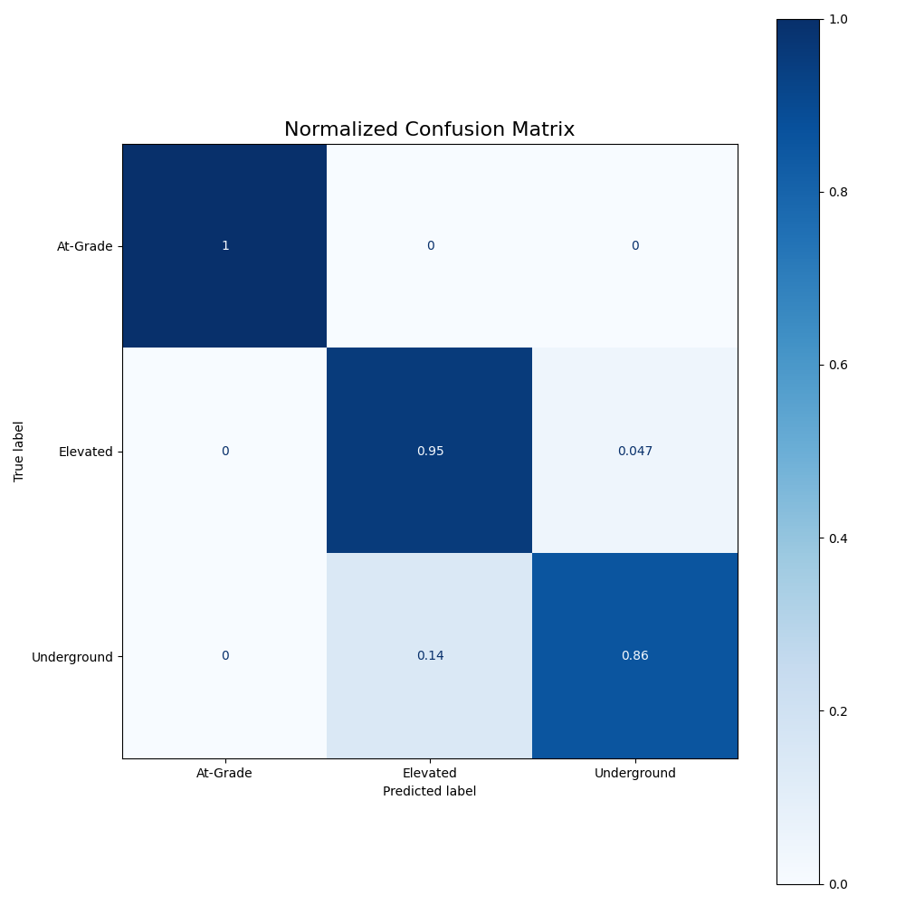

# 🚇 Delhi Metro Station Classification using Machine Learning



## 📘 Overview

This project uses **Machine Learning** to analyze and classify **Delhi Metro stations** based on various attributes such as their layout, distance, and year of opening. The goal is to **predict the layout type (Elevated, At-Grade, Underground)** using the features provided in the dataset, with a focus on solving a severe class imbalance problem.

---

## 🧾 Dataset Source

This project uses the **Delhi Metro dataset** publicly available on Kaggle:
[Delhi Metro Dataset on Kaggle](https://www.kaggle.com/datasets/ummiee/delhi-metro-dataset)

---

## 🧠 Objectives

* Analyze Delhi Metro dataset for insights and trends.

* **Critically Handle Class Imbalance** using a robust hybrid approach (SMOTE + Class Weights).

* Train a **Random Forest Classifier** to accurately predict station layout.

* Evaluate performance using a successful **3x3 Confusion Matrix** and detailed classification metrics.

---

## 📂 Dataset Information

**File:** `Delhi metro.csv`

| Column Name | Description | 
 | ----- | ----- | 
| ID (Station ID) | Unique ID for each metro station | 
| Station Names | Name of the station | 
| Dist. From First Station (km) | Distance (in km) from the first station on the line | 
| Metro Line | Metro line name (e.g., Red Line) | 
| Opened(Year) | Year the station was opened | 
| Layout | Type of structure (Elevated / At-Grade / Underground) | 
| Latitude | Station latitude | 
| Longitude | Station longitude | 

---

## ⚙️ Data Preprocessing

* Converted **Opened(Year)** from `DD-MM-YYYY` to a numeric year.

* **Crucial Fix:** Applied **Stratification** during the train-test split (`stratify=y`) to ensure the minority class was represented.

* Encoded categorical features using **OneHotEncoder**.

* Used **ColumnTransformer** for pipelined preprocessing.

* Applied **SMOTE** to address class imbalance in layout categories, setting **`k_neighbors=3`** to avoid errors.

## 🤖 Model Building

**Model Used:** `RandomForestClassifier`

**Pipeline:**
The model uses an `imblearn.pipeline` for a robust, one-step execution of preprocessing, sampling, and training.

1. Split data into **training (80%)** and **testing (20%)** sets, ensuring **stratification**.

2. Built a combined pipeline incorporating the preprocessor, **SMOTE**, and the classifier.

3. **Hybrid Solution:** The classifier uses **`class_weight='balanced'`** to further combat bias against the minority class.

```python
# Code Snippet: The final, hybrid pipeline structure
from imblearn.pipeline import Pipeline
from imblearn.over_sampling import SMOTE
from sklearn.ensemble import RandomForestClassifier

# Example of the structure used for the final model
model_pipeline = Pipeline(steps=[
    ('preprocessor', preprocessor), 
    ('sampler', SMOTE(random_state=42, k_neighbors=3)), 
    ('classifier', RandomForestClassifier(
        random_state=42, 
        class_weight='balanced'
    )) 
])
# model_pipeline.fit(X_train, y_train) 
# y_pred = model_pipeline.predict(X_test)
```  
## 📈 Model Evaluation
The model successfully overcame bias, resulting in accurate prediction across all classes.

- ✅ **Accuracy Score**  
- 📊 **Classification Report** (Precision, Recall, F1-score)  
- 🌀 **Confusion Matrix**: Achieved a robust 3x3 matrix, confirming the model's ability to predict the minority *At-Grade* class.  

---

## 💡 Key Insights
- **Imbalance Overcome:** The hybrid approach (SMOTE + Class Weights) was crucial to moving from a biased model (2x2 matrix) to a reliable one (3x3 matrix).  
- **Random Forest** performed robustly on the mixed numeric and categorical features.  
- **Data Quality:** Converting the `Opened(Year)` date format to a clean numeric year was a critical preprocessing step.  

---

## 🧰 Technologies Used

| Category   | Tools / Libraries |
|------------|-------------------|
| Language   | Python 🐍 |
| Libraries  | pandas, numpy, matplotlib, scikit-learn, imblearn |
| Model      | Random Forest Classifier |
| Environment| Jupyter Notebook (.ipynb) |

---

## 🗂 Project Structure
```
├── data/
│   └── Delhi metro.csv
├── notebooks/
│   └── machine learning project.ipynb
├── images/
│   └── confusion_matrix.png
└── README.md
```

---

## 🚀 How to Run the Project
1️⃣ Clone this repo  
```bash
git clone https://github.com/your-username/Delhi-Metro-ML-Project.git
cd Delhi-Metro-ML-Project
```
2️⃣ Install dependencies
```bash
pip install pandas scikit-learn matplotlib imbalanced-learn
```
3️⃣ Open & run the notebook
```bash
jupyter notebook "machine learning project.ipynb"
```
## 🌱 Future Improvements
- Incorporate geospatial visualizations (e.g., using **folium** or **plotly**).  
- Benchmark other models like **XGBoost** or **LightGBM** for comparison.  
- Add passenger footfall or ridership data for regression modeling.  

---

## 🏷️ License & Author
**Author:** Harshal Naik  
**License:** Licensed under the MIT License — feel free to reuse and adapt.  

⭐ If this project helped you, don’t forget to **Star it on GitHub!** ⭐
